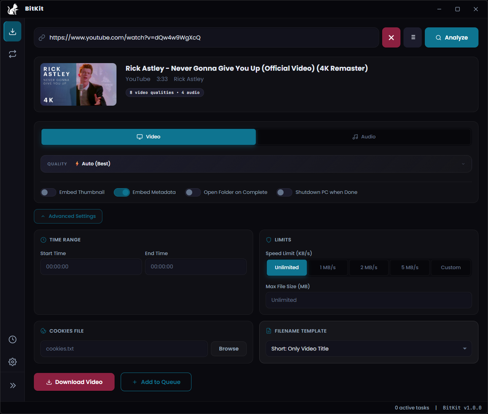
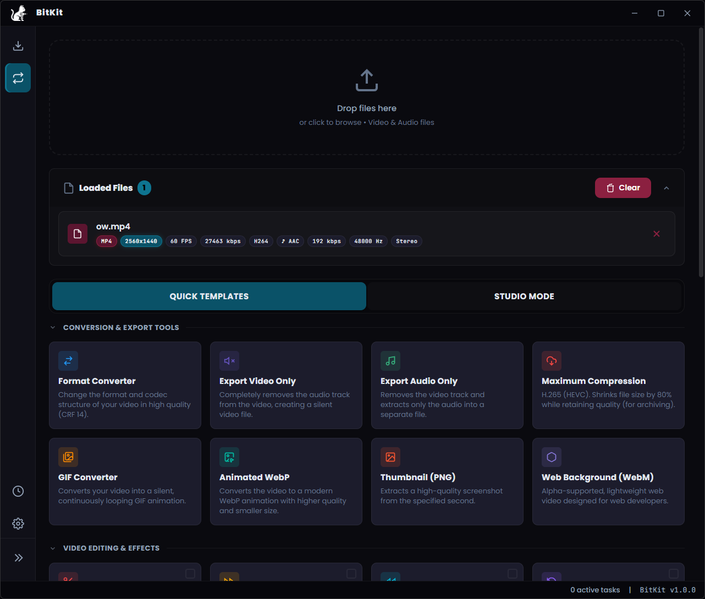
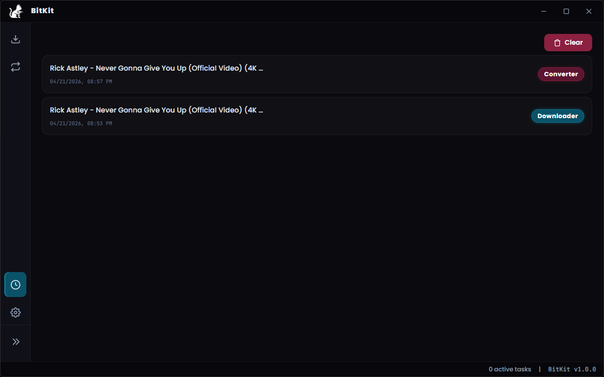
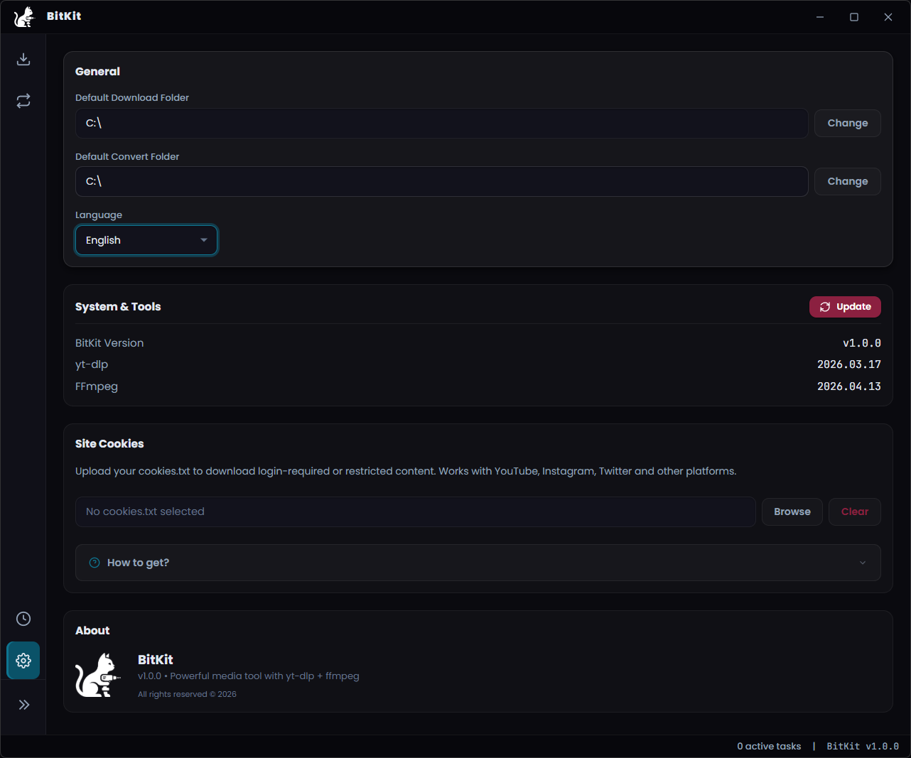

<p align="center">
  
</p>

<h1 align="center">BitKit</h1>

<p align="center">
  <b>Advanced media downloader and converter powered by yt-dlp & FFmpeg</b>
</p>

<p align="center">
  
  
  
  
</p>

<p align="center">
  <a href="#-features">Features</a> •
  <a href="#-screenshots">Screenshots</a> •
  <a href="#-installation">Installation</a> •
  <a href="#-tech-stack">Tech Stack</a> •
  <a href="#-license">License</a>
</p>

---

## 🎯 What is BitKit?

BitKit is a modern, privacy-focused desktop application for downloading, converting, and processing media files. It wraps the power of [yt-dlp](https://github.com/yt-dlp/yt-dlp) and [FFmpeg](https://github.com/FFmpeg/FFmpeg) behind a sleek, intuitive interface — no command line required.


## ✨ Features

### 📥 Downloader
- Download video & audio from **1000+ websites** (YouTube, Twitter/X, Instagram, TikTok, Reddit, and more)
- **Batch download** and full **playlist support**
- Choose exact **video quality** (up to 8K), **audio bitrate**, and **output format**
- **Trim before download** — set start/end timestamps
- **Cookie support** for age-restricted or private content
- Embed **thumbnails** and **metadata** automatically

### 🔄 Converter
- Convert between all major formats: **MP4, MKV, WebM, AVI, MOV, MP3, FLAC, WAV, Opus, AAC** and more
- Full **codec control** (H.264, H.265/HEVC, VP9, AV1) with **hardware acceleration** (NVENC, QSV, AMF)
- Adjustable **CRF quality**, bitrate, resolution, FPS, and audio sample rate
- Drag & drop files directly into the app

### ⚡ Quick Templates (30+ Presets)
One-click presets for common tasks:

| Category | Templates |
|---|---|
| 🎬 **Format** | Smart Convert, Video Mute, Audio Extract, GIF, Animated WebP, WebM |
| ✂️ **Edit** | Trim, Timelapse, Slow Motion, Rotate, Reverse, Split |
| 🔊 **Audio** | Volume Boost, Loudness Normalize, Audio Denoise |
| 🎨 **Filters** | Denoise, Sharpen, Stabilize, Auto-Crop, HDR→SDR, Motion Interpolation |
| 📱 **Platform** | TikTok/Reels, Discord, WhatsApp |

Templates can be **combined** — stack multiple filters in a single pass.

### ⚙️ General
- Full **download & conversion history**
- **Multi-language** support (English, Turkish, Spanish, German, French, Russian, Italian, Portuguese, Polish, Japanese, Chinese)
- Built-in **yt-dlp & FFmpeg updater**
- Custom output directories and filename templates

---

## 📸 Screenshots

<p align="center">
  
  <br><em>Downloader — Analyze and download from any URL</em>
</p>

<p align="center">
  
  <br><em>Converter — 30+ one-click Quick Templates</em>
</p>

<p align="center">
  
  <br><em>History — Track all downloads and conversions</em>
</p>

<p align="center">
  
  <br><em>Settings — Customize everything</em>
</p>

---

## 📦 Installation

### Download Release
1. Go to the [Releases](../../releases) page
2. Download the latest `.exe` installer
3. Run the installer — BitKit will automatically download the required binaries on first launch

### Build from Source
```bash
git clone https://github.com/HolyZephyros/BitKit.git
cd BitKit
npm install

# Download required binaries (yt-dlp & ffmpeg)
.\scripts\fetch-bins.ps1

npm run dev       # Development
npm run build     # Build distributable
```

---

## 🧰 Tech Stack

| Layer | Technology |
|---|---|
| **Framework** | [Electron 41](https://github.com/electron/electron) |
| **Media Engine** | [yt-dlp](https://github.com/yt-dlp/yt-dlp) + [FFmpeg](https://github.com/FFmpeg/FFmpeg) |
| **Frontend** | Vanilla HTML/CSS/JS |
| **Build** | [electron-builder](https://www.electron.build/) |

---

## 📄 License

The source code is licensed under the **MIT License** — see [LICENSE](LICENSE) for details.